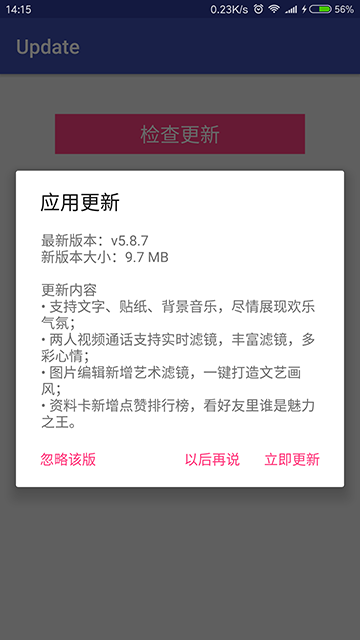
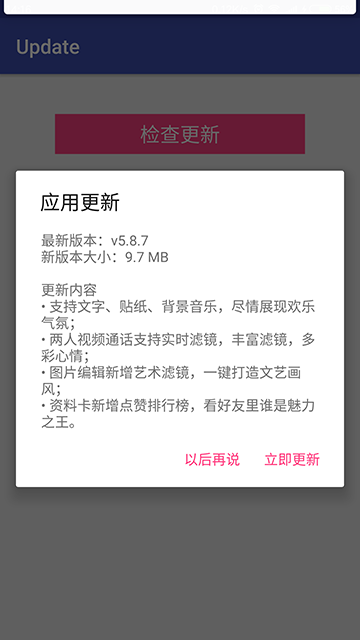
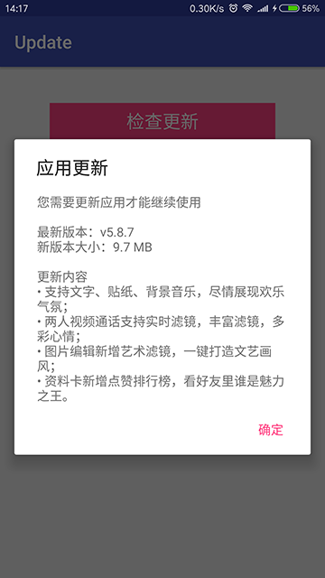
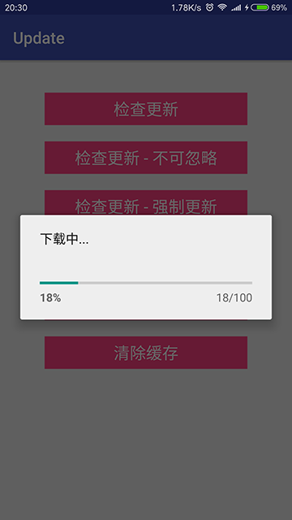

# update [](https://jitpack.io/#czy1121/update)

清晰灵活简单易用的应用更新库


- 支持断点续传
- 支持静默下载：有新版本时不提示直接下载
- 支持强制安装：不安装无法使用app
- 支持下载完成后自动安装
- 支持可忽略版本
- 支持app启动时强制安装下载好了的更新包
- 支持POST请求
- 支持自定义解析服务器返回的数据
- 支持自定义查询/下载
- 支持自定义提示对话框/下载进度对话框
- 支持通知栏进度显示
- 适配 Android 7.0 FileProvider

 
 

## Gradle

[](https://jitpack.io/#czy1121/update)

``` groovy
repositories {
    maven { url "https://jitpack.io" }
}

dependencies {
    compile 'com.github.czy1121:update:1.1.1'
}
```

## Usage


**基本用法**

默认情况下，查询请求会需要三个参数: 包名(package), 版本号(version), 渠道(channel)
package/version 从应用的 context 获取

``` java
// 设置默认更新接口地址与渠道
UpdateManager.setUrl(mCheckUrl, "yyb");
```

``` java
// 进入应用时查询更新
UpdateManager.check(context);
```

``` java
// 在设置界面点击检查更新
UpdateManager.checkManual(context);
```

``` java
// 如果有已经下载好了的更新包就强制安装，可以在app启动时调用
UpdateManager.install(context);
```

假设，包名是`ezy.demo.update`，版本号为`123`
传入地址 `http://example.com/check`，传入渠道 `yyb`
那请求的url是 `http://example.com/check?package=ezy.demo.update&version=123&channel=yyb`

**设置请求url**

设置url后不会额外添加 package/version/channel 等参数

``` java
UpdateManager.create(this).setUrl(mCheckUrl).check();
```

**发送POST请求**

``` java
UpdateManager.create(this).setUrl(mCheckUrl).setPostData("param=abc&param2=xyz").check();
```

**解析查询结果**

查询结果需要解析成 UpdateInfo

``` java
public class UpdateInfo {
    // 是否有新版本
    public boolean hasUpdate = false;
    // 是否静默下载：有新版本时不提示直接下载
    public boolean isSilent = false;
    // 是否强制安装：不安装无法使用app
    public boolean isForce = false;
    // 是否下载完成后自动安装
    public boolean isAutoInstall = true;
    // 是否可忽略该版本
    public boolean isIgnorable = true;

    public int versionCode;
    public String versionName;
    public String updateContent;

    public String url;
    public String md5;
    public long size;
}

```

关于md5

1. 有新版本时，url与md5字段为必填
2. md5始终是是url所表示的**apk文件内容的md5**，不是keystore的md5
3. md5用于确保安装的是完整正确apk，防止下载过程中apk内容被修改篡改替换
4. 不知道如何获取文件md5可参考Update.md5或google/baidu


可以定制解析过程

``` java
UpdateManager.create(this).setUrl(mCheckUrl).setParser(new IUpdateParser() {
    @Override
    public UpdateInfo parse(String source) throws Exception {
        UpdateInfo info = new UpdateInfo();
        // todo
        return info;
    }
}).check();
```

**定制查询**

``` java

UpdateManager.create(this).setUrl(mCheckUrl).setChecker(new IUpdateChecker() {
    @Override
    public void check(ICheckAgent agent, String url) {
        HttpURLConnection connection = null;
        try {
            connection = (HttpURLConnection) new URL(url).openConnection();
            connection.setRequestProperty("Accept", "application/json");
            connection.connect();
            if (connection.getResponseCode() == HttpURLConnection.HTTP_OK) {
                agent.setInfo(UpdateUtil.readString(connection.getInputStream()));
            } else {
                agent.setError(new UpdateError(UpdateError.CHECK_HTTP_STATUS, "" + connection.getResponseCode()));
            }
        } catch (IOException e) {
            e.printStackTrace();
            agent.setError(new UpdateError(UpdateError.CHECK_NETWORK_IO));
        } finally {
            if (connection != null) {
                connection.disconnect();
            }
        }
    }
}).check();
```

**定制下载**

``` java
UpdateManager.create(this).setUrl(mCheckUrl).setDownloader(new IUpdateDownloader() {
    @Override
    public void download(IDownloadAgent agent, String url, File temp) {
        new UpdateDownloader(agent, context, url, temp).execute();
    }
}).check();

```

**更新版本对话框**

``` java
UpdateManager.create(this).setPrompter(new IUpdatePrompter() {
    @Override
    public void prompt(IUpdateAgent agent) {
        // todo : 根据 agent.getInfo() 显示更新版本对话框，具体可参考 UpdateAgent.DefaultUpdatePrompter
    }
}).check();
```

**没有新版本或出错**

``` java
UpdateManager.create(this).setOnFailure(new OnFailureListener() {
    @Override
    public void onFailure(UpdateError error) {  
        Toast.makeText(mContext, error.toString(), Toast.LENGTH_LONG).show();
    }
}).check();
```

**显示下载进度**

可在通知栏显示下载进度，当 info.isSilent 为 true 显示

默认通知栏进度

``` java
UpdateManager.create(this).setNotifyId(998).check();
```

定制通知栏进度

``` java
UpdateManager.create(this).setOnNotificationDownloadListener(new OnDownloadListener() {
    @Override
    public void onStart() {
        // todo: start
    }

    @Override
    public void onProgress(int progress) {
        // todo: progress
    }

    @Override
    public void onFinish() {
        // todo: finish
    }
}).check();
```

定制下载进度的对话框，当 info.isSilent 为 false 显示

``` java
UpdateManager.create(this).setOnDownloadListener(new OnDownloadListener() {
    @Override
    public void onStart() {
        // todo: start
    }

    @Override
    public void onProgress(int progress) {
        // todo: progress
    }

    @Override
    public void onFinish() {
        // todo: finish
    }
}).check();
```
**国际化**

启动时调用此初始化方法
``` java
private void initUpdateResource() {
    SparseArray<String> messages = UpdateError.messages;
    messages.put(UpdateError.UPDATE_IGNORED, getString(R.string.UP_UPDATE_IGNORED));
    messages.put(UpdateError.UPDATE_NO_NEWER, getString(R.string.UP_UPDATE_NO_NEWER));
    messages.put(UpdateError.CHECK_UNKNOWN, getString(R.string.UP_CHECK_UNKNOWN));
    messages.put(UpdateError.CHECK_NO_WIFI, getString(R.string.UP_CHECK_NO_WIFI));
    messages.put(UpdateError.CHECK_NO_NETWORK, getString(R.string.UP_CHECK_NO_NETWORK));
    messages.put(UpdateError.CHECK_NETWORK_IO, getString(R.string.UP_CHECK_NETWORK_IO));
    messages.put(UpdateError.CHECK_HTTP_STATUS, getString(R.string.UP_CHECK_HTTP_STATUS));
    messages.put(UpdateError.CHECK_PARSE, getString(R.string.UP_CHECK_PARSE));
    messages.put(UpdateError.DOWNLOAD_UNKNOWN, getString(R.string.UP_DOWNLOAD_UNKNOWN));
    messages.put(UpdateError.DOWNLOAD_CANCELLED, getString(R.string.UP_DOWNLOAD_CANCELLED));
    messages.put(UpdateError.DOWNLOAD_DISK_NO_SPACE, getString(R.string.UP_DOWNLOAD_DISK_NO_SPACE));
    messages.put(UpdateError.DOWNLOAD_DISK_IO, getString(R.string.UP_DOWNLOAD_DISK_IO));
    messages.put(UpdateError.DOWNLOAD_NETWORK_IO, getString(R.string.UP_DOWNLOAD_NETWORK_IO));
    messages.put(UpdateError.DOWNLOAD_NETWORK_BLOCKED, getString(R.string.UP_DOWNLOAD_NETWORK_BLOCKED));
    messages.put(UpdateError.DOWNLOAD_NETWORK_TIMEOUT, getString(R.string.UP_DOWNLOAD_NETWORK_TIMEOUT));
    messages.put(UpdateError.DOWNLOAD_HTTP_STATUS, getString(R.string.UP_DOWNLOAD_HTTP_STATUS));
    messages.put(UpdateError.DOWNLOAD_INCOMPLETE, getString(R.string.UP_DOWNLOAD_INCOMPLETE));
    messages.put(UpdateError.DOWNLOAD_VERIFY, getString(R.string.UP_DOWNLOAD_VERIFY));

    UpdateAgent.UP_DESC = getString(R.string.UP_DESC);
    UpdateAgent.UP_TITLE = getString(R.string.UP_TITLE);
    UpdateAgent.UP_FORCE_INFO = getString(R.string.UP_FORCE_INFO);
    UpdateAgent.UP_CONFIRM = getString(R.string.UP_CONFIRM);
    UpdateAgent.UP_IMMEDIATE = getString(R.string.UP_IMMEDIATE);
    UpdateAgent.UP_LATER = getString(R.string.UP_LATER);
    UpdateAgent.UP_IGNORE = getString(R.string.UP_IGNORE);
    UpdateAgent.UP_DOWNLOADING = getString(R.string.UP_DOWNLOADING);
    UpdateAgent.UP_DOWN_TITLE = getString(R.string.UP_DOWN_TITLE);
}
```

zh-rCN/strings.xml

``` xml
<string name="UP_UPDATE_IGNORED">该版本已经忽略</string>
<string name="UP_UPDATE_NO_NEWER">已经是最新版了</string>
<string name="UP_CHECK_UNKNOWN">查询更新失败：未知错误</string>
<string name="UP_CHECK_NO_WIFI">查询更新失败：没有 WIFI</string>
<string name="UP_CHECK_NO_NETWORK">查询更新失败：没有网络</string>
<string name="UP_CHECK_NETWORK_IO">查询更新失败：网络异常</string>
<string name="UP_CHECK_HTTP_STATUS">查询更新失败：错误的HTTP状态</string>
<string name="UP_CHECK_PARSE">查询更新失败：解析错误</string>
<string name="UP_DOWNLOAD_UNKNOWN">下载失败：未知错误</string>
<string name="UP_DOWNLOAD_CANCELLED">下载失败：下载被取消</string>
<string name="UP_DOWNLOAD_DISK_NO_SPACE">下载失败：磁盘空间不足</string>
<string name="UP_DOWNLOAD_DISK_IO">下载失败：磁盘读写错误</string>
<string name="UP_DOWNLOAD_NETWORK_IO">下载失败：网络异常</string>
<string name="UP_DOWNLOAD_NETWORK_BLOCKED">下载失败：网络中断</string>
<string name="UP_DOWNLOAD_NETWORK_TIMEOUT">下载失败：网络超时</string>
<string name="UP_DOWNLOAD_HTTP_STATUS">下载失败：错误的HTTP状态</string>
<string name="UP_DOWNLOAD_INCOMPLETE">下载失败：下载不完整</string>
<string name="UP_DOWNLOAD_VERIFY">下载失败：校验错误</string>
<string name="UP_DESC">最新版本：%1$s\n新版本大小：%2$s\n\n更新内容:\n%3$s</string>
<string name="UP_TITLE">应用更新</string>
<string name="UP_FORCE_INFO">您需要更新应用才能继续使用\n\n%s</string>
<string name="UP_CONFIRM">确定</string>
<string name="UP_IMMEDIATE">立即更新</string>
<string name="UP_LATER">以后再说</string>
<string name="UP_IGNORE">忽略该版</string>
<string name="UP_DOWNLOADING">下载中...</string>
<string name="UP_DOWN_TITLE">下载中 - %s</string>
```

values/strings.xml

``` xml
<string name="UP_UPDATE_IGNORED">This version was ignored.</string>
<string name="UP_UPDATE_NO_NEWER">It is the latest version!</string>
<string name="UP_CHECK_UNKNOWN">Check update failed: unknown error.</string>
<string name="UP_CHECK_NO_WIFI">Check update failed: no WIFI.</string>
<string name="UP_CHECK_NO_NETWORK">Check update failed: no network.</string>
<string name="UP_CHECK_NETWORK_IO">Check update failed: network error.</string>
<string name="UP_CHECK_HTTP_STATUS">Check update failed: network error.</string>
<string name="UP_CHECK_PARSE">Check update failed: network error.</string>
<string name="UP_DOWNLOAD_UNKNOWN">Download failed: unknown error.</string>
<string name="UP_DOWNLOAD_CANCELLED">Download failed: user canceled.</string>
<string name="UP_DOWNLOAD_DISK_NO_SPACE">Download failed: no enough disk space.</string>
<string name="UP_DOWNLOAD_DISK_IO">Download failed: disk write error.</string>
<string name="UP_DOWNLOAD_NETWORK_IO">Download failed: network error.</string>
<string name="UP_DOWNLOAD_NETWORK_BLOCKED">Download failed: network error.</string>
<string name="UP_DOWNLOAD_NETWORK_TIMEOUT">Download failed: network timeout.</string>
<string name="UP_DOWNLOAD_HTTP_STATUS">Download failed: network error.</string>
<string name="UP_DOWNLOAD_INCOMPLETE">Download failed: download is incomplete.</string>
<string name="UP_DOWNLOAD_VERIFY">Download failed: verification error.</string>
<string name="UP_DESC">Current Version：%1$s\nSize：%2$s\n\nUpdate:\n%3$s</string>
<string name="UP_TITLE">APP Update</string>
<string name="UP_FORCE_INFO">You need to update your app to continue\n\n%s</string>
<string name="UP_CONFIRM">Confirm</string>
<string name="UP_IMMEDIATE">Update Now</string>
<string name="UP_LATER">Remind Me Later</string>
<string name="UP_IGNORE">Ignore This Version</string>
<string name="UP_DOWNLOADING">Downloading...</string>
<string name="UP_DOWN_TITLE">Downloading - %s</string>
```


## License

```
Copyright 2016 czy1121

Licensed under the Apache License, Version 2.0 (the "License");
you may not use this file except in compliance with the License.
You may obtain a copy of the License at

   http://www.apache.org/licenses/LICENSE-2.0

Unless required by applicable law or agreed to in writing, software
distributed under the License is distributed on an "AS IS" BASIS,
WITHOUT WARRANTIES OR CONDITIONS OF ANY KIND, either express or implied.
See the License for the specific language governing permissions and
limitations under the License.
```
